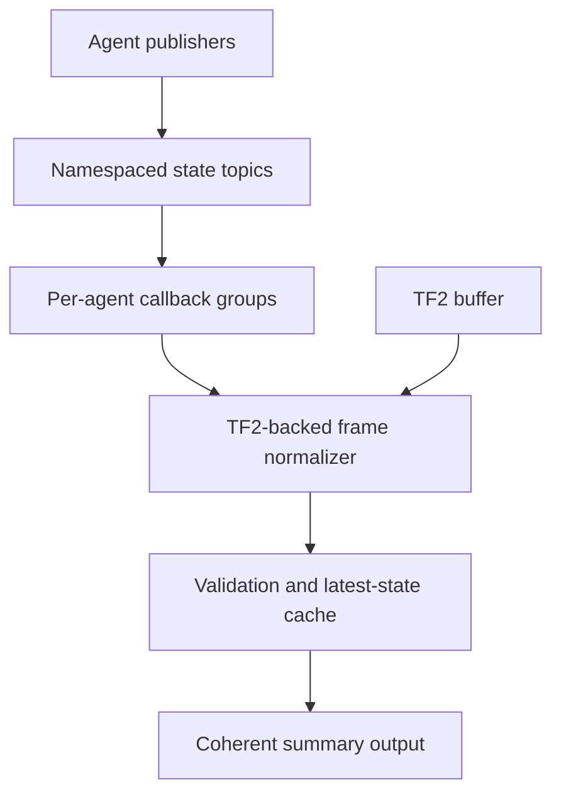

# ROS 2 Frame-Aware Multi-Agent State Pipeline

A C++17/ROS 2 Jazzy pipeline that normalizes timestamped state from multiple
agents into a common coordinate frame and maintains a concurrency-safe
latest-state cache.

## Project overview

Three parameterized instances of one simulator publish `AgentState` messages
and TF for independent odometry/body frame pairs. A coordinator validates each
stream, performs an exact-source-time TF2 lookup, normalizes pose and velocity
into `map`, and stores only accepted state. Periodic summaries classify each
configured agent as `NEVER_SEEN`, `FRESH`, or `STALE`.

This repository focuses on the data-processing boundary between per-agent
state producers and a common-frame consumer. It does not implement estimation,
navigation, task allocation, or vehicle control.

## Key engineering features

- C++17 nodes and reusable processing components on ROS 2 Jazzy
- Custom `swarm_interfaces/msg/AgentState` contract
- Three namespaced agent publishers built from one executable
- Deterministic straight-line and coordinated-turn motion
- Per-agent `odom` and `base_link` frames with TF2 publication
- Source-timestamp frame lookup and pose/vector normalization
- `SensorDataQoS` for freshness-oriented state streams
- Configurable `MultiThreadedExecutor` with per-agent callback groups
- Mutex-protected immutable cache records and coherent snapshots
- Identity, frame, quaternion, timestamp, and sequence validation
- Sequence-gap detection, controlled dropout, and stale-state classification
- Unit, concurrency, stress, and frame-processing tests
- Optional ThreadSanitizer instrumentation

## Architecture



Normalization is deliberately upstream of cache mutation. A sample with a
missing transform, invalid frame, timestamp, or quaternion cannot replace the
last accepted state or refresh its receipt time.

See [Architecture](docs/architecture.md),
[Concurrency design](docs/concurrency-design.md), and
[Frame semantics](docs/frame-semantics.md) for the design details.

## Package layout

| Package | Responsibility |
| --- | --- |
| `swarm_interfaces` | Frame-aware `AgentState` message contract |
| `swarm_core` | Reusable source-timestamp ordering policy |
| `agent_simulator` | Deterministic state and TF publisher |
| `swarm_coordinator` | Frame normalization, validation, cache, executor policy, and summaries |
| `swarm_bringup` | Multi-agent launch configuration |

## Requirements

- Ubuntu 24.04
- ROS 2 Jazzy
- `colcon` and `rosdep`
- `tf2_tools` for optional frame-tree inspection

Install the ROS-specific tooling if it is not already present:

```bash
sudo apt update
sudo apt install \
  ros-jazzy-desktop \
  ros-jazzy-tf2-tools \
  python3-colcon-common-extensions \
  python3-rosdep
```

## Build

Run from the repository root:

```bash
source /opt/ros/jazzy/setup.bash
rosdep install --from-paths src --ignore-src -r -y
colcon build --symlink-install
source install/setup.bash
```

All C++ targets use C++17 with `-Wall -Wextra -Wpedantic` under GCC and Clang.

## Test

```bash
source /opt/ros/jazzy/setup.bash
source install/setup.bash
colcon test
colcon test-result --verbose
```

The repository contains 29 GTest cases across five test executables. They cover
source ordering, cache and freshness invariants, concurrent readers/writers,
frame validation and transformation, and the normalizer-to-cache boundary.

## Run

```bash
ros2 launch swarm_bringup multi_agent_pipeline.launch.py
```

The summary reports source states after normalization into `map`, for example:

```text
Swarm summary: agent_1=[FRESH seq=... frame=map p=(...)] agent_2=[FRESH ...]
```

A small number of transform rejections may occur during startup before static
TF data reaches the coordinator. Later samples should be accepted.

## Controlled dropout demonstration

```bash
ros2 launch swarm_bringup multi_agent_pipeline.launch.py \
  agent_2_dropout_after_s:=4.0
```

Agent 2 stops publishing state and dynamic TF after four seconds. Its last
accepted record remains available and becomes `STALE` after the configured
1.5-second timeout.

## Frame-tree inspection

In a second terminal, source ROS 2 and this workspace, then run:

```bash
ros2 topic echo /agent_2/state --once
ros2 run tf2_ros tf2_echo map agent_2/odom
ros2 run tf2_ros tf2_echo map agent_2/base_link
ros2 run tf2_tools view_frames
```

The source message uses `agent_2/odom` as `header.frame_id` and
`agent_2/base_link` as `child_frame_id`; the coordinator summary reports the
normalized record in `map`.

## Concurrency and TSan verification

Callback instrumentation is disabled by default. To demonstrate permitted
cross-agent overlap:

```bash
ros2 launch swarm_bringup multi_agent_pipeline.launch.py \
  coordinator_executor_threads:=4 \
  instrument_callbacks:=true \
  processing_delay_ms:=200
```

An `active_agent_callbacks` value above one shows callbacks from different
agent groups overlapping. Each agent subscription remains in its own
`MutuallyExclusive` group.

For an isolated ThreadSanitizer run of the cache concurrency suite:

```bash
source /opt/ros/jazzy/setup.bash

colcon --log-base log-tsan build \
  --build-base build-tsan \
  --install-base install-tsan \
  --packages-up-to swarm_coordinator \
  --cmake-args \
    -DSWARM_COORDINATOR_ENABLE_TSAN=ON \
    -DCMAKE_BUILD_TYPE=RelWithDebInfo

source install-tsan/setup.bash
TSAN_OPTIONS=halt_on_error=1:second_deadlock_stack=1 \
  ./build-tsan/swarm_coordinator/test_agent_state_cache_concurrency
```

## Design decisions

- `SensorDataQoS` favors recent state over retransmission of old samples.
- One `MutuallyExclusive` callback group per agent permits cross-agent
  parallelism without same-agent callback overlap.
- Immutable cache records keep post-lock reads safe and lock hold times short.
- One snapshot API binds state, receipt time, age, and freshness to a coherent
  cache view.
- TF lookup uses the message source timestamp; zero/latest timestamps are
  rejected.
- Pose receives translation and rotation, while the project-defined velocity
  vectors receive rotation only.
- Transform rejection drops the current sample rather than queueing stale work.
- Staleness uses local steady-clock receipt time, independent of source clocks.

## Scope and limitations

- Membership is configured at startup through an explicit agent list.
- Sequence validation assumes one stable publisher run; restart/session
  identity is not yet represented in `AgentState`.
- Unavailable transforms cause immediate sample rejection; there is no delayed
  message queue.
- Health is a coarse simulated field, not a structured diagnostics system.
- The motion model is deterministic test input, not vehicle dynamics.
- The pipeline is not a state estimator, navigation stack, swarm controller,
  sensor-fusion system, or hard real-time executor.
